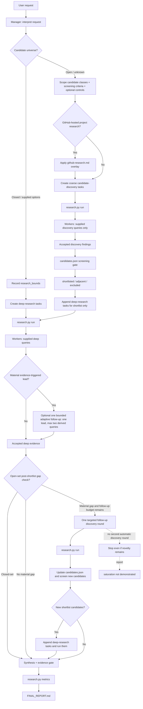

# DeepReserch runner

`research.py` is a small vendor-neutral execution layer for **manager-owned deep research**. Claude Code or Codex plans, screens, decides what to research next, synthesizes evidence, and owns the final stop decision. OpenCode or Cursor CLI workers execute bounded source-backed research tasks. Python owns deterministic scheduling, validation, durable state, recovery, retry/fallback mechanics, and mechanical source-group metrics.

The design deliberately keeps research strategy out of `research.py`: the manager is the reasoning layer, workers are bounded evidence collectors, and the runner is the deterministic execution/state layer.

## Requirements

- Python 3.11+ standard library only.
- At least one installed/authenticated worker CLI: OpenCode or Cursor CLI.
- No database, daemon, queue, workflow engine, YAML contract, Pydantic, or JSON-schema package.

## Responsibilities

### Manager — Claude Code or Codex

The manager owns:

- interpreting the user request and deciding whether the candidate universe is closed or open;
- decomposition and query generation;
- request-specific `research_bounds`;
- open-set candidate classes and screening criteria;
- candidate discovery, canonicalization, fork/mirror independence judgments, and shortlist decisions;
- cross-task contradiction and gap analysis;
- deciding whether the single bounded follow-up discovery round is needed;
- evidence-to-insight mapping and source-independence judgment;
- synthesis, recommendations, final prose, and the stop/saturation decision.

`prompts/manager.md` is the authoritative manager contract. For open-set GitHub-project research, `prompts/github-research.md` is a narrow GitHub-specific overlay; it does not replace the generic manager workflow.

### Runner — `research.py`

The runner owns deterministic mechanics only:

- task admission and immutable task fingerprints;
- bounded concurrency and per-task timeouts;
- worker launch and research-safe backend configuration;
- primary/repair/fallback attempt sequencing;
- raw attempt capture and normalized result validation;
- durable `state.json` transitions and crash recovery;
- mechanical source-group metrics.

It does **not** decide which candidates are relevant, whether a trend exists, whether evidence is semantically independent, whether discovery is complete, or what the final answer should say.

### Workers — OpenCode or Cursor CLI

Workers are bounded evidence collectors. Every manager-authored task begins with exactly one mode marker:

- `Task mode: candidate-discovery`
- `Task mode: deep-research`

Workers execute the manager-authored supplied queries first and return source-backed findings only.

For `candidate-discovery`, workers stay coarse/high-recall and have **zero derived-search budget**: they may inspect pages/documents returned by the supplied queries, but they do not invent additional search queries or deeply investigate promising candidates.

For `deep-research`, after the supplied queries and first-pass evidence, a worker may perform **zero or one** evidence-triggered adaptive follow-up round inside that invocation/attempt: one material lead, at most two tightly related derived search queries, plus the fetches required to inspect that lead. It cannot recursively expand research, create manager tasks, perform global gap analysis, or decide that the run is complete.

## Run layout

```text
runs/<session>/
  plan.json
  candidates.json
  state.json
  raw/
  results/
  synthesis.json
  metrics.json
  FINAL_REPORT.md
```

`candidates.json` is manager-owned and appears only for open-set candidate discovery. `research.py` does not validate or interpret it.

`runs/**` is ignored by Git.

## End-to-end research workflow



The important separation is:

1. **Discovery asks “what candidates might exist?”**
2. **Screening asks “which discovered candidates deserve deeper work?”**
3. **Deep research asks “what is actually true about the shortlist?”**
4. **Gap check asks “did the shortlist research reveal one material discovery hole?”**
5. **Synthesis asks “what conclusions are supported by accepted evidence?”**

The pipeline is intentionally coarse-to-fine. Finding a candidate does not automatically justify deep research, and a discovery snippet is not sufficient evidence for a final recommendation.

## 1. Choose the research path

### Closed-set research

Use direct deep research when the user already supplied the option set, for example “compare A and B.” The manager records the research budget, creates only the deep-research tasks needed for those options, executes them, resolves evidence gaps/contradictions within budget, then synthesizes.

Do not manufacture a candidate-discovery phase unless the user explicitly asks to broaden the option set.

### Open-set research

Use candidate discovery when the user asks to find analogs, alternatives, projects, approaches, tools, solutions, or recommendations from an unknown/broad universe.

Before the first run, the manager:

1. defines 3–5 request-specific candidate classes, adapted from direct analogs, architectural analogs, standalone components, alternative approaches, and methodologies/research;
2. defines hard constraints and inclusion/exclusion criteria;
3. for important/high-cost runs, may define a small thematic control set to test recall;
4. records immutable run bounds;
5. creates **discovery tasks only** for the initial run.

## 2. Record immutable research bounds

Before executing anything, the manager writes practical limits into `plan.json`. These values are chosen for the request and are not silently increased after work has begun.

Example:

```json
{
  "topic": "Find and compare relevant approaches",
  "research_bounds": {
    "task_budget": 12,
    "follow_up_task_budget": 4,
    "follow_up_discovery_rounds": 1,
    "max_workers": 4,
    "per_task_timeout_seconds": 300,
    "backend_guidance": null
  },
  "tasks": [
    {
      "id": "discovery_mechanisms",
      "title": "Mechanism discovery",
      "objective": "Task mode: candidate-discovery\nFind candidate projects through mechanism/capability vocabulary",
      "queries": [
        "durable autonomous research orchestration projects",
        "resumable multi-agent evidence pipeline"
      ]
    }
  ]
}
```

For closed-set work, the same shape is used but tasks start with `Task mode: deep-research`, and `follow_up_discovery_rounds` is normally `0`.

Task definitions become immutable once an attempt exists. Changed research is appended under a new task ID rather than rewriting historical work.

## 3. Coarse discovery for open-set research

The generic manager workflow uses 3–4 stable query routes whose combined coverage includes:

- **problem / user language** — how the user describes the pain point or desired outcome;
- **product / category language** — how candidate solutions are conventionally named;
- **mechanism / capability language** — technical mechanisms that could solve the problem under a different product name;
- **neighboring ecosystem / snowballing** — related work, inspirations, dependencies, comparisons, citations, lists, directories, README links, and terminology discovered from evidence.

These are query routes, not additional worker types or runner phases.

Popularity is never an admission gate. A candidate may reach screening with few users, few stars, sparse metadata, or an unfamiliar name if accepted discovery evidence shows material semantic relevance.

Discovery workers execute only the supplied search strings and inspect the returned evidence. They do not use adaptive derived searches; that keeps discovery reproducible and prevents a promising candidate from silently consuming deep-research budget before the screening gate.

## 4. GitHub open-set discovery overlay

When the open candidate universe consists of GitHub-hosted projects/repositories, the manager additionally applies `prompts/github-research.md`.

The overlay translates the generic discovery routes into four GitHub-oriented query families:

1. **problem / user vocabulary** — symptom phrases, workflow pain points, desired outcomes, issue/discussion language;
2. **product / category vocabulary** — project, library, framework, tool, protocol, plugin, server, client, runtime, and ecosystem terms;
3. **mechanism / capability vocabulary** — architecture, protocol, runtime, storage, orchestration, integration, data-flow, execution-model, and distinctive mechanism phrases;
4. **adjacent / long-tail / relationship snowballing** — dependencies, inspirations, alternatives, related-work sections, linked projects, topics, issue/discussion references, forks/upstreams, mirrors, and distinctive phrases.

The required executable path stays the same: workers use the configured **Exa-first web search/read path**, with built-in web tools as fallback when Exa is unavailable, errors, or is insufficient. GitHub REST/MCP may be used by a manager or verification environment when already available, but it is optional and is not an alternate admission path.

A repository enters `candidates.json` only through accepted discovery evidence (`<task-id>:<finding-id>`). Manager memory or an unrecorded API lookup is not enough.

### GitHub semantic admission

Semantic relevance is evaluated before popularity/activity metadata. A repository can reach screening even when it has:

- zero/few stars;
- sparse or missing topics;
- a new or unfamiliar name;
- no obvious category keyword in its name/README;
- little historical popularity metadata.

Stars, forks, contributor counts, release totals, and lifetime activity may inform later maturity analysis, but they do not decide whether a semantically relevant project is allowed into screening.

### Forks and mirrors

Canonicalization does not turn derivative repositories into independent evidence.

- An unchanged/trivially changed fork or mirror may be kept as an explicit `excluded` ledger entry when needed to preserve discovery provenance.
- The exclusion reason identifies the upstream/duplicate relationship.
- Derivative forks/mirrors do not count as independent corroboration or as separate technique/trend signals.
- A fork may remain an independent candidate only when accepted evidence shows a materially independent design or product direction.
- The manager uses cheap available repository/docs evidence; there is no recursive fork crawler or graph store.

### GitHub activity, momentum, and trend

Deep activity enrichment remains **shortlist-only**. A shortlisted repository may be researched for repository age, meaningful recent activity, release cadence, commit/contributor/issue/PR activity, relationships relevant to maturity/independence, and mechanisms recurring across independent projects.

The final report must distinguish:

- **technique / mechanism** — a technical pattern; no temporal claim;
- **current activity / momentum** — recent activity interpreted in repository age/category context;
- **trend** — a stronger temporal claim that requires an explicit time basis, such as change/cadence over a stated window and/or a mechanism recurring recently across multiple independent projects.

A single point-in-time star/fork count or lifetime activity total is never enough to claim growth or trend strength.

For GitHub open-set runs, `FINAL_REPORT.md` includes an observation timestamp/date cutoff and a compact evidence-backed map conceptually shaped as:

```text
technique / current signal -> representative independent projects -> observed evidence -> maturity / caveat
```

## 5. Screening gate — `candidates.json`

After the initial open-set discovery run, the manager reads accepted discovery findings and writes `candidates.json`.

Every materially distinct discovered candidate receives:

- a canonical URL;
- a candidate class/category;
- the route(s) that discovered it;
- at least one accepted `<task-id>:<finding-id>` evidence reference;
- exactly one disposition: `shortlisted`, `adjacent`, or `excluded`;
- a reason consistent with the request-specific screening criteria.

This keeps two states distinct:

- **not discovered**;
- **discovered and excluded**.

The shortlist is the explicit acceptance gate between broad discovery and expensive deep research.

## 6. Deep research the shortlist

Only shortlisted candidates receive deep-research tasks.

Deep research may cover capabilities, architecture, limitations, maturity/activity, license, primary-source evidence, differences from the user's target, and transferable ideas.

A deep-research worker:

1. executes all manager-authored supplied queries first;
2. inspects first-pass evidence;
3. if one material lead is both new and consequential, may perform zero or one bounded adaptive follow-up round;
4. that round is limited to one lead and at most two tightly related derived search queries;
5. returns ordinary source-backed findings and stops.

The adaptive follow-up is **per invocation/attempt**. Existing retry/fallback mechanics are runner-owned; a fallback attempt is a fresh bounded attempt. Workers never convert their local follow-up into recursive/global discovery.

## 7. One manager-owned post-shortlist gap check

After shortlist research, the manager performs one open-set gap check. It asks whether discovery missed something material, for example:

- a candidate class is unrepresented;
- discovery depended on one vocabulary;
- the sample is biased toward popular/well-known projects;
- smaller/newer/documentation-first/historical candidates are missing;
- mechanism/category terms learned from evidence were never searched;
- related-work, dependency, inspiration, fork/upstream, or distinctive-term evidence exposes a missing candidate;
- a request-specific control failed to appear naturally.

If no material gap exists, synthesis begins.

If a material gap exists and the recorded budget allows it, the manager may append **one targeted follow-up discovery round** using new `candidate-discovery` task IDs. After that round it updates `candidates.json`, screens new candidates under the same criteria, and deeply researches any newly justified shortlist entries before synthesis.

There is no second automatic discovery round.

Automatic discovery therefore ends in one of two states:

- **early saturation** — a reasonable reformulation/snowballing pass adds no new material candidate or solution class;
- **follow-up budget exhausted** — novelty still appears after the single permitted follow-up round. Stop automatic discovery and report **`saturation not demonstrated`** rather than pretending completeness was proven.

## 8. Synthesis and evidence gate

The manager writes `synthesis.json` using evidence references of the form `<task-id>:<finding-id>`.

Before `FINAL_REPORT.md` is written, the manager applies the evidence gate:

- recommendation-bearing claims without accepted evidence are removed or explicitly marked unverified;
- malformed/unresolvable evidence references are rejected;
- a citation must actually support the claim; citation existence alone is insufficient;
- canonical URLs are normalized;
- mirrors, forks, syndicated copies, and derivative republications are clustered before semantic corroboration is described.

Recommendations and detailed comparisons must rely on accepted **deep-research** evidence, not discovery-only snippets.

## 9. Mechanical source-group metrics

After `synthesis.json` exists, run:

```bash
python research.py metrics --session <session>
```

For GitHub URLs the mechanical group is `github.com/<owner>/<repo>`; other URLs group by normalized hostname. Duplicate findings from one group count once.

`metrics.json` includes per-insight depth, average, median, minimum, weak insight IDs (`depth < 2`), and each insight's group list.

This metric is deliberately limited: different hosts or repositories do **not** prove publisher/editorial independence, and source-group depth is not a completeness or saturation score. The manager owns those semantic judgments.

## 10. Final report

`FINAL_REPORT.md` is manager-authored. For open-set research it includes the relevant coverage state:

- candidate classes searched;
- shortlisted candidates;
- notable adjacent candidates;
- important exclusions and reasons;
- whether discovery ended by early saturation or follow-up-budget exhaustion;
- known limitations, including `saturation not demonstrated` when applicable.

For GitHub current-signal analysis it also records the observation timestamp/date cutoff and separates technical patterns from temporal activity/momentum/trend claims.

## Running workers

Run OpenCode workers with Cursor fallback using the exact bounds previously recorded in `plan.json`:

```bash
python research.py run --session demo --backend opencode --fallback-backend cursor --max-workers 4 --timeout 300
```

Or use Cursor as primary:

```bash
python research.py run --session demo --backend cursor
```

Do not copy these example concurrency/timeout values blindly; command-line values must match the manager-owned recorded bounds for the run.

A task-local failure remains data and the command exits `0`; inspect the summary or:

```bash
python research.py status --session demo
```

Runner-fatal admission/state/backend-configuration errors exit non-zero.

## Research-safe worker modes

Research workers never write result files themselves. They return their answer on stdout; `research.py` captures the exact stdout/stderr bytes into a no-clobber raw-attempt envelope and writes validated normalized results.

### Cursor

Cursor is invoked non-interactively with Ask mode and runner-owned Exa MCP configuration:

```text
cursor-agent --print --mode=ask --output-format text --approve-mcps --workspace <runner-run-directory> <prompt>
```

At launch, the runner writes `<runner-run-directory>/.cursor/mcp.json` with only the remote
`exa` server (`https://mcp.exa.ai/mcp`) and points Cursor at that workspace. `--approve-mcps`
is required for non-interactive MCP use, but Cursor documents it as approving **all** configured
MCP servers; it has no per-server approval flag. Project-level config and `CURSOR_CONFIG_DIR`
were tested as narrower alternatives: project config still merges global servers, and the
environment variable is not a supported CLI configuration mechanism. Thus a clean host gets
only runner-configured Exa, while a host with extra global MCPs (such as this verification host)
will approve those too; the runner cannot scope that Cursor approval further.

The runner never adds `--force`/`--yolo` and never falls back to a write-capable Cursor mode.
Cursor CLI exposes its native `webSearchRequestQuery`/web fetch interaction but no mechanical
deny configuration for those built-in web tools. Ask mode leaves those requests approval-gated
(and the non-interactive runner rejects them), which is not equivalent to an explicit deny; this
remains a documented Cursor security gap. The executable can be overridden with `--cursor-command`.

### OpenCode

OpenCode is invoked with `opencode run` and a runner-owned inline agent. `OPENCODE_CONFIG_CONTENT` is merged at runtime so both the global permission layer and the selected `deep-research-worker` agent explicitly deny:

- `edit`
- `bash`
- `external_directory`
- `task`

The injected config defines only the remote Exa MCP server and allows its exact
`exa_web_search_exa`/`exa_web_fetch_exa` tools at both permission layers. OpenCode's built-in
`websearch` and `webfetch` tools remain allowed at both layers as a fallback when Exa is
unavailable, errors, or returns insufficient results. Exa preference is a prompt-level quality
policy, not a mechanical guarantee; the existing closed-world agent default and `read` rules
denying `*.env`/`*.env.*` remain in force.

Each host namespaces MCP tool names differently: the server publishes `web_search_exa`, OpenCode
addresses it as `exa_web_search_exa`, and Cursor as `exa-web_search_exa`. `prompts/worker.md`
therefore tells workers to match on the name suffix rather than on an exact identifier, so a
worker does not mistake a namespacing difference for Exa being unavailable and fall back
needlessly.

Before `opencode run` is allowed to start, the runner executes `opencode debug config` with the exact same executable and environment and validates the resolved effective configuration. Both the global and `deep-research-worker` permission layers must still deny `edit`, `bash`, `external_directory`, and `task`; the selected agent must exist in `primary` mode; and the enabled Exa remote MCP must resolve to the runner-owned URL. Missing, malformed, overridden, or permissive effective configuration returns `opencode_safe_mode_preflight_failed:*` and the worker process is never launched. The raw `debug config` output is deliberately not persisted because resolved provider/MCP configuration can contain credentials.

The actual invocation requests OpenCode's machine-readable `--format json` event stream and does not attach to an arbitrary pre-existing `opencode serve` process. After a successful worker process, the runner applies a second independent check: it extracts the session ID from those events and queries `opencode export <sessionID>`, requiring the exported session's `info.agent` to equal `deep-research-worker`. A missing, ambiguous, unexportable, or different agent is a task-local `opencode_agent_verification_failed:*` failure, so the result cannot be accepted or silently attributed to OpenCode's default agent. Both checks fail closed if their respective CLI/session-record contracts change. The executable can be overridden with `--opencode-command`.

These controls are mechanical. The worker prompt also says not to write, but prompt wording is not the security boundary.

## Durable attempts and recovery

Before every external worker subprocess starts, `state.json` atomically records the attempt ordinal, kind, backend, and `in_flight` phase. That write consumes the lifetime attempt.

If the runner dies after this durable start but before a complete raw outcome exists, restart marks the task `failed` with an interrupted/unknown reason and **does not replay the external call**. If a complete raw envelope exists, restart can safely continue the deterministic transition table without relaunching that attempt.

Each complete `raw/<task>-attempt-NN.txt` is a `deep-research-raw-attempt/v2` envelope. Besides the captured outcome, it records the exact child `argv`, a closed audit projection of the injected OpenCode config, and the runner-written Cursor `.cursor/mcp.json` content. The persisted OpenCode projection keeps only audit-relevant permission entries, the selected agent's mode/model/permissions, the runner-owned Exa MCP fields, and the configured model. Provider structure may be retained for diagnostics, but **every provider value is replaced with `[REDACTED]` regardless of its key name**; unrelated host config and arbitrary agent fields are omitted entirely. The credential-key matcher is therefore not the secrecy boundary. The full worker prompt remains in `argv` deliberately: it is launch evidence, not a credential source.

`v2` is not backward compatible on purpose: a `v1` envelope is rejected, so a session started before this change cannot be resumed and fails loudly instead of being read under the wrong assumptions. Since `runs/**` is disposable and ungitted, the migration cost is one abandoned in-flight session. Start a new session rather than trying to resume across the upgrade.

An OpenCode attempt captures the raw JSON event stream in `stdout_b64` and the reconstructed worker answer in `answer_stdout_b64`. That reconstruction concatenates the `text` events of the session, so worker output parsing is coupled to OpenCode's event structure rather than to plain stdout bytes. A change in that structure surfaces as a parse failure, not as silently wrong findings, but it is a real dependency on the CLI's output contract.

The automatic lifetime policy is closed:

1. primary research;
2. optional primary format repair after invalid JSON/required fields;
3. optional fallback research;
4. never a fourth invocation, never a repair of fallback output, and never a same-backend process retry.

A completed normalized result is fingerprint-bound to its immutable task definition. If a crash happens after the result file is durable but before `state.json` reaches `completed`, resume validates and reconciles the result without relaunching the worker.

## Verification

Deterministic unit tests:

```bash
python -m unittest -v tests.test_research
```

### Live Cursor smoke (conditional but mandatory when installed/authenticated)

Use a disposable clean Git checkout. Record `git status --porcelain` before and after. Create a one-task plan whose answer can be found through web/read tools, then run:

```bash
python research.py run --session smoke-cursor --backend cursor --max-workers 1
```

PASS requires:

- accepted parseable `results/<task>.json`;
- raw attempt captured;
- actual invocation uses `--mode=ask`;
- `git status --porcelain` is identical before and after.

If Cursor is unavailable or unauthenticated on the verification host, record that explicit skip; do not claim live verification.

### Live OpenCode smoke (conditional but mandatory when installed/authenticated)

In a separate disposable clean checkout, run:

```bash
python research.py run --session smoke-opencode --backend opencode --max-workers 1
```

PASS requires:

- accepted parseable result;
- raw attempt captured;
- pre-run resolved config confirms the selected `deep-research-worker`, both permission-layer denies for `edit`, `bash`, `external_directory`, and `task`, and the runner-owned Exa MCP;
- the post-run exported session confirms `deep-research-worker`;
- repository status is unchanged.

If OpenCode is unavailable or unauthenticated on the verification host, record that explicit skip; do not claim live verification.
